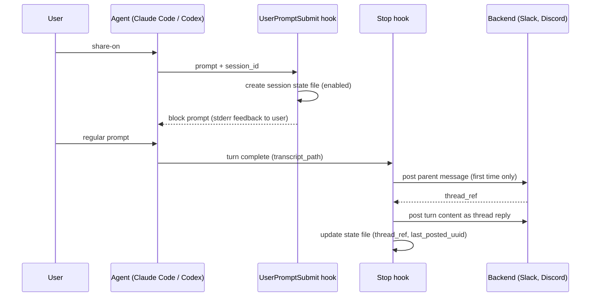

# ag-share Design

A general-purpose tool that forwards coding-agent session content to a team chat service, turn by turn, so a team can follow work in near real time. Two seams keep it general: chat services sit behind a backend interface (Slack, Discord), and agents sit behind a transcript-source interface (Claude Code, Codex). Built entirely on the agents' hooks mechanisms, with no dependency on any specific project.

## Goals

- Forward session exchanges (user input + agent responses) to a thread in the configured chat service that teammates can follow
- **Opt-in**: only sessions explicitly enabled are forwarded. By default nothing is sent
- **Per-repo destination**: the target service + channel is configurable per repository, shared by all agents
- **Pluggable backends**: the backend interface is the seam for further chat services
- **Pluggable agents**: Claude Code and Codex are supported; the transcript-source interface plus per-agent hook registration is the seam for others
- **Threading**: one session = one thread. Only a single parent message appears in the channel itself
- Usable by multiple people on multiple machines (idempotent setup via plugin installation)

## Non-goals

- Real-time streaming of every tool call (turn granularity is sufficient; avoids flooding)
- Two-way integration (controlling the session from the chat service)
- Automatic redaction of secrets in forwarded content (left to opt-in and human judgment)
- Multiple destinations per repo (one repo entry = one destination; fan-out is out of scope)

## Architecture



- **UserPromptSubmit hook**: detects toggle prompts — a prompt consisting **exactly** of `share-on` / `share-on-from-begin` / `share-off` (exact match kills false positives; bare words rather than `#`-prefixed markers because leading `#` is the Claude Code CLI's memory shortcut), or the raw slash-command strings `/ag-share:on` / `/ag-share:on-from-begin` / `/ag-share:off` (verified on Claude Code: slash commands reach the hook as the raw typed string, not the expanded markdown) — switches session state, and **blocks** the toggle prompt. Verified empirically on Claude Code: a blocked prompt leaves no user entry in the transcript and the model is never invoked, so the toggle turn costs no tokens and is never forwarded; the hook's stderr is displayed to the user as immediate feedback. The plugin also ships `commands/on.md` / `off.md` for discoverability; their body only ever expands if the hook failed to intercept, so it instructs the model to tell the user the toggle did not take effect
- **Stop hook**: on turn completion, extracts the turn's content from the transcript and posts it to the backend thread. On Claude Code, Stop fires only for the main agent (subagent completion fires `SubagentStop`, which this tool does not register) and does not fire on user interrupts (hooks guide); Codex documents the same event set
- Both hooks exit 0 immediately for non-enabled sessions (minimal overhead)

### Agent abstraction

Codex implements a hooks mechanism intentionally compatible with Claude Code's (hooks doc, learn.chatgpt.com/docs/hooks): the same events (`UserPromptSubmit`, `Stop`), the same stdin JSON fields (`session_id`, `transcript_path`, `cwd`, `prompt`), the same exit-2-blocks semantics, plugin-bundled hooks files with the same schema, and even `CLAUDE_PLUGIN_ROOT` provided to plugin hooks for compatibility. ag-share therefore runs the **same binary and the same hook logic for both agents**; only two things differ per agent:

1. **The transcript format** — completely different on disk. The `transcript.Source` interface (`LatestCursor` / `Title` / `SplitAfter`) hides it; cursor strings are opaque and format-specific
2. **Hook registration** — each agent's plugin manifest points at its own hooks file (`.claude-plugin/plugin.json` → `hooks/claude.json`, `.codex-plugin/plugin.json` → `hooks/codex.json`), and that file passes `--agent claude` / `--agent codex` to the binary

The agent is thus a **registration-time fact, not a runtime guess**: no sniffing of transcript contents, no environment heuristics. An unknown `--agent` value is rejected (a typo must not silently pick the wrong parser). One session state schema and one config serve both agents; the parent message labels the agent (Slack: `:claude:` / `:codex:` emoji, Discord: `[claude]` / `[codex]`).

Codex-specific operational facts (verified against the hooks doc and codex-cli 0.145.0 unless noted):

- Hooks are a stable, default-on feature (`codex features list`: `hooks stable true`)
- Codex requires the user to review and **trust each hook definition** (by hash) before it runs — `/hooks` in a Codex session; untrusted hooks are skipped silently. This is a per-install, per-hook-change approval; the README documents it as an install step. Hook definitions live in the plugin and change rarely (binary updates flow through `bin/run.sh`, not the hook definition)
- Unverified empirically (requires an interactively-trusted hook): actual hook firing with payload, whether `transcript_path` points at the session rollout file, whether Stop fires after the rollout's `task_complete` record is flushed (if not, forwarding lags one turn — content is never lost, the cursor just advances at the next Stop), and whether hooks fire in `codex exec`. These are the first things to check in real use

### Codex transcript extraction

A Codex session transcript ("rollout", `~/.codex/sessions/YYYY/MM/DD/rollout-*.jsonl`) is JSONL of `{timestamp, type, payload}` records. Like the Claude format it is internal and explicitly documented as unstable; the rules were derived from real rollouts and are pinned by `testdata/codex-rollout.jsonl` — the tripwire for format changes.

- **User prompt**: `event_msg` records with `payload.type == "user_message"` (`payload.message`)
- **Agent text**: `event_msg` with `payload.type == "agent_message"` — all phases, including commentary between tool calls
- **Tool call count**: `response_item` records with `payload.type == "function_call"`
- **Turn boundary / cursor**: `event_msg` with `payload.type == "task_complete"`; its `turn_id` is the cursor value stored in `last_posted_uuid`. Rollout lines have no per-line UUID, so the completed turn is the cursor unit
- Everything else is skipped: `session_meta`, `turn_context`, `reasoning`, `function_call_output`, `token_count`, ...
- Content after the last `task_complete` belongs to a turn still in flight and is left for a later Stop — on ambiguity, never post
- Rollouts carry no title record (Codex keeps thread names in a separate index file, another unstable internal), so `Title()` returns `""` and the prompt-head fallback names the thread

### Backend abstraction

A backend is anything that can host "one parent message + a thread of replies". The interface has three operations:

- `CreateThread(destination, info) → thread_ref`: post the parent message, return an opaque reference to its thread
- `PostReply(destination, thread_ref, text)`: post one turn into that thread
- `UpdateThread(destination, thread_ref, info)`: rewrite the parent message (topic refresh); best-effort, never affects turn posting

plus backend-owned formatting: markup for quotes/code fences, message length limits, and truncation budget all live inside the backend. Core code (hooks, transcript extraction, state, opt-in resolution) never sees service-specific types — `thread_ref` is stored in session state as an opaque string (Slack: the parent message `ts`; Discord: a thread/channel ID). A backend that cannot thread cannot satisfy this interface; that is a deliberate requirement, not a limitation to work around.

### Coexistence with other hook-based tools

Both agents' hook systems are additive by design (verified against the Claude Code hooks guide; Codex documents the same merge model):

- Multiple hooks registered on the same event all run; one hook blocking (exit 2) does not prevent others from running, and decisions combine with most-restrictive-wins
- Hook timeouts are per-hook; a slow hook does not delay other hooks

On top of that, this tool stays inert toward others: the only decision it ever emits is blocking its own exact-match toggle prompt, it always exits 0 otherwise, and sets a short per-hook `timeout` so a backend outage cannot stall the session. Distribution as a plugin means settings files are never modified.

### Slack backend: why a bot token instead of an Incoming Webhook

Incoming Webhook responses do not include the posted message's `ts`, so `CreateThread` cannot return a usable `thread_ref`. The threading requirement makes `chat.postMessage` (Web API + bot token) mandatory. The only required scope is `chat:write`. The bot must be invited to the target channel.

### Discord backend: why a bot token instead of a webhook

Discord webhooks can create threads only in forum/media channels (error 220003 elsewhere) and can never rename a thread, so the webhook route would force forum channels and freeze the topic at creation. A bot token has neither limit (verified against the official docs):

- `CreateThread`: post the parent message to a text channel, then Start Thread from Message — the created thread's ID **equals** the parent message ID, which becomes `thread_ref`
- `PostReply`: post into `/channels/{thread_ref}/messages` (2000-char content limit; posting auto-unarchives the thread)
- `UpdateThread`: rename the thread (`PATCH /channels/{thread_ref}`) — allowed without `MANAGE_THREADS` because the bot is the thread creator. The topic lives in the **thread name** (visible in the channel's thread list); the parent message body stays constant
- REST calls only; no Gateway connection or privileged intents. Invite URL: `scope=bot&permissions=309237648384` (VIEW_CHANNEL + SEND_MESSAGES + CREATE_PUBLIC_THREADS + SEND_MESSAGES_IN_THREADS)

## Opt-in resolution

Priority: session state file > the matching repo entry's `default` in user config > off.

Three toggle prompts, each self-contained — mistake resistance beats orthogonality (no separate cursor commands, no hidden state-dependent behavior):

1. `share-on` → enabled; on the disabled→enabled transition the cursor moves to the latest transcript entry, so forwarding starts from the **next** turn. Neither pre-toggle history nor `share-off` periods can ever be posted by the bare command. Already enabled → no-op
2. `share-on-from-begin` → enabled + cursor to the session start: the whole session so far is replayed into the thread, one reply per turn, then forwarding continues normally. Retroactive posting happens only via this long, explicit command. If the thread already has posts, the replay repeats them (warned in the feedback)
3. `share-off` → disabled. The state file is kept (`enabled: false`), so a later `share-on` continues the same thread — minus the turns that happened while off
4. If the repo entry sets `"default": "on"`, the session is enabled from the start (for repos the user always wants to share). `share-off` can still disable an individual session

All toggle prompts are blocked by the hook: never forwarded, never processed by the model.

If no destination config is found for the repo, nothing is forwarded regardless of toggles (there is no destination).

## Configuration

Secrets and non-secrets live in different places.

All configuration lives in a single machine-local user config. Nothing is ever committed into target repositories: what gets forwarded is each user's own decision, so a repo must not be able to turn forwarding on for someone else, and target repos stay free of tool-specific files.

### User config (machine-local, never committed)

`~/.config/ag-share/config.json` (respects `XDG_CONFIG_HOME`; `AG_SHARE_HOME` overrides the whole data directory). The location is agent-neutral on purpose: one config serves every supported agent, so it cannot live under either agent's dotdir. There is no fallback to the pre-rename cc-share location — a decision, not an omission.

```json
{
  "repos": {
    "github.com/acme/product": {
      "service": "slack",
      "bot_token": "xoxb-...",
      "channel": "C0XXXXXXX",
      "default": "on"
    },
    "github.com/me/sandbox": { "service": "slack", "bot_token": "xoxb-...", "channel": "C0YYYYYYY" }
  }
}
```

One flat map keyed by the repo's identity (see below). A key ending in `/*` matches by prefix (`"github.com/neguse/*"` covers every repo under that owner); an exact key always wins, and among wildcard matches the longest prefix wins. Per entry:

- `service`: backend ID (`"slack"` or `"discord"`). Selects the backend and which of the remaining fields it reads — each backend defines its own credential/destination fields
- `default`: `"on" | "off"` (defaults to `"off"`) — backend-independent

Slack backend fields:

- `bot_token`: the Slack bot token for the workspace the channel belongs to. Repos posting to the same workspace simply repeat the token — a user deals with a handful of workspaces at most, and duplication is cheaper than an indirection layer
- `channel`: target channel ID

Discord backend fields (same names, that service's meaning):

- `bot_token`: the Discord bot token
- `channel`: target text channel ID (threads are created in it)

The file holds credentials, so it must be readable by the owner only (0600 / equivalent Windows ACL); the hook warns to `error.log` if it is wider.

Team coordination is by convention, not by mechanism: sharing "post v-puro sessions to C0XXXXXXX" as a one-line snippet is enough, since every user needs to configure a token anyway.

### Repo identity

Hooks resolve the current repo from `cwd`: the git remote URL of `origin`, normalized to `host/owner/repo` (strips protocol, credentials, and `.git` suffix). This makes one config entry match across machines and checkout locations. For repositories without a remote (or non-git directories), an absolute-path key can be used instead. If no entry matches, nothing is forwarded regardless of toggles (there is no destination).

### Session state (auto-generated, ephemeral)

`~/.config/ag-share/sessions/<session_id>.json`

```json
{
  "enabled": true,
  "repo": "github.com/acme/product",
  "service": "slack",
  "channel": "C0XXXXXXX",
  "thread_ref": "1234567890.123456",
  "posted_topic": "fix the login bug",
  "last_posted_uuid": "..."
}
```

- `thread_ref`: opaque, backend-defined reference to the thread parent (Slack: the parent message `ts`), recorded on first post
- `last_posted_uuid`: the cursor for incremental posting — opaque and agent-format-specific (Claude: UUID of the last forwarded transcript entry; Codex: `turn_id` of the last forwarded completed turn)
- Writes are atomic (write to a temp file, then rename), since the Stop hook and the next prompt's UserPromptSubmit hook can overlap
- Stale state files are deleted age-based (e.g. 7 days) during hook execution
- Claude Code `--resume` keeps the `session_id` and appends to the same transcript file (verified empirically with `claude -p --resume`), so session state and the thread continue naturally across resumes. Forked sessions presumably get new IDs and therefore new threads — acceptable. Codex `resume`/`fork` behavior is assumed analogous (session IDs are unique either way; the worst case is a new thread)

## Message content

### Parent message (first post of a session)

```
:claude: {repo} — {topic} (by {user}@{host})
```

This single line is all that appears in the channel; the leading emoji names the agent (`:claude:` / `:codex:`; Discord spells the agent name out instead). Everything else goes into the thread.

The topic makes threads scannable in the channel. Source, in priority order:

1. The session title the agent auto-generates, where the format has one (Claude Code `ai-title` transcript records; interactive sessions only — print mode never writes them. Codex rollouts have none)
2. At thread creation, when no title exists (yet): the head of the first forwarded prompt (60 runes, single line)

The title appears and improves over time, so each Stop compares the latest title against `posted_topic` in session state and rewrites the parent (`UpdateThread`; Slack: `chat.update`, covered by `chat:write`) when it changed. The refresh is best-effort and never affects the cursor.

### Thread replies (per turn, Stop hook)

Extracted from the turn's transcript entries and combined into one message:

- The user prompt (quoted)
- All of the agent's text blocks, including commentary between tool calls (not just the final response — in investigation-heavy turns the findings often live there)
- Tool calls themselves are not included; only a count is appended (e.g. `(12 tool calls)`)

Extraction routes every entry through a single filter per agent format, so narrowing later (e.g. to final-response-only) is a local change. The extracted content is service-neutral; the backend renders it — markup (Slack mrkdwn / Discord markdown), code fences, and truncation to the service's message limit (head + `…(truncated)`, budget owned by the backend) are all backend concerns.

### Incremental transcript extraction

The Stop hook reads `transcript_path` (JSONL) and processes entries after `last_posted_uuid`. Cursor rules:

- On enablement, `last_posted_uuid` is set to the latest cursor position (UserPromptSubmit also receives `transcript_path`, verified on Claude Code); history from before `share-on` is never posted retroactively
- Claude Code `/compact` does not rewrite history: it appends a `compact_boundary` system entry plus a summary entry flagged `isCompactSummary: true` (verified on real transcripts), so the cursor survives compaction; summary entries are never forwarded
- If the cursor is nevertheless not found in the transcript (defensive, e.g. unknown future rewrites), the cursor resets to the latest position and that turn is skipped — on ambiguity, never post retroactively
- The range after the cursor is split at turn boundaries and posted as **one reply per turn**, advancing the cursor after each successful post (with a short pacing delay between replies). A single-turn Stop posts one reply as before; a multi-turn range (catch-up after failures, `share-on-from-begin` replay) reproduces the thread as if forwarding had been on the whole time — and a failure or hook timeout mid-replay resumes from the last posted turn at the next Stop
- On a failed post, the cursor is not advanced past it; the unposted turns ride along at the next Stop (natural catch-up — see Error handling)
- A turn ended by user interrupt fires no Stop hook; its content is picked up at the next Stop. If the session ends on that interrupt, the turn is never posted

### Claude Code transcript entry filter

The JSONL format is an internal, undocumented format; these rules were derived from real transcripts and are pinned by test fixtures, which are the tripwire when a Claude Code update changes the format.

- **User prompt**: `type == "user"` whose `message.content` is a plain string, excluding entries flagged `isMeta` or `isCompactSummary`. Skill/command expansions and tool results arrive as array-content or `isMeta` entries, so this rule excludes them by construction. System-generated turns (e.g. background-task notifications) match this rule and are forwarded in v1; the filter function is the seam if that proves noisy
- **Claude text**: `type == "assistant"` content blocks of type `text` (in practice one block per entry). `thinking` blocks are never forwarded
- **Tool call count**: the number of `tool_use` blocks in the range
- Everything else is skipped: `system`, `queue-operation`, `attachment`, `file-history-*`, `last-prompt`, `ai-title`, mode/permission records, `tool_result` entries
- Subagent transcripts live under a separate `<session-id>/subagents/` directory and never appear in the main transcript (verified), so subagent turns are excluded by construction

The Codex filter is specified in "Codex transcript extraction" above.

## Error handling

- Backend API failures, missing credentials, or network outage must **never interfere with the agent session**. Hooks always exit 0 (even on fatal errors)
- Failures are appended to `~/.config/ag-share/error.log` for debugging. The log records error metadata only, never forwarded message content — it must not become a second leak path
- Rate limits are a backend concern, and turn granularity keeps volume low enough that none is expected to matter (Slack: `chat.postMessage` allows ~1 msg/sec/channel with bursts). No in-turn retries; a failed post leaves the cursor unadvanced, so the content is retried as part of the next turn's message

## Implementation

### Language: Go (single static binary)

Neither agent guarantees a script runtime on its host: Claude Code's native installer removes the Node dependency (setup docs), `python3` is never a stated requirement, and on Windows hooks run under Git Bash — present only when Git for Windows is installed. Every scripting choice therefore imposes some prerequisite on users:

| Candidate            | Runtime prerequisites                                              | Notes                             |
| -------------------- | ------------------------------------------------------------------ | --------------------------------- |
| Go binary            | None at runtime                                                    | CI build/release pipeline needed  |
| Python 3 (stdlib)    | python3 on PATH (commonly missing on Windows)                      | Simplest source distribution      |
| POSIX sh + jq + curl | Git Bash on Windows, plus jq everywhere (not bundled anywhere)     | JSONL parsing in sh+jq is fragile |
| Node.js              | node on PATH (no longer implied by Claude Code's native installer) | —                                 |

A Go CLI cross-compiled to a static binary per platform eliminates runtime dependencies entirely, and handles JSONL parsing, the backend APIs, and state management in a testable language. The cost is a build/distribution pipeline, which is acceptable for a tool meant to be installed by many people.

### CLI structure

One binary, `ag-share`, with a subcommand per hook and the agent passed at registration time:

- `ag-share hook-prompt --agent claude|codex` — UserPromptSubmit: toggle detection
- `ag-share hook-stop --agent claude|codex` — Stop: transcript extraction and forwarding

Both read the hook input JSON from stdin, as both agents' hooks contracts specify. A missing `--agent` means `claude` (hook registrations predating the flag); an unknown value is rejected.

### Binary distribution

GitHub Releases assets are downloadable without auth (public repo). Binaries are therefore **not committed to the repo**; the dispatch script fetches them on demand:

- GitHub Actions cross-compiles on tag push and uploads binaries as release assets
- Targets: `windows-amd64`, `linux-amd64`, `darwin-arm64`, `darwin-amd64`
- The repo commits only a `bin/VERSION` file (release tag to fetch) and `bin/checksums.txt` (SHA-256 per asset), both updated by CI on release
- On first run, `bin/run.sh` downloads the asset for the current platform into `~/.config/ag-share/bin/<version>/`, verifies its checksum against the committed `checksums.txt`, and execs it. Subsequent runs exec the cached binary directly (no network)
- Plugin installation clones this repo (both agents' plugin managers work from git checkouts), so the pinned checksum arrives over the same git channel as the code itself; a tampered release asset fails verification
- If the download fails (offline, GitHub outage), the hook logs to `error.log` and exits 0 — never breaking the session. It retries on the next hook invocation
- The very first hook invocation pays the download once. If it exceeds the hook timeout, that invocation is lost — a toggle prompt passes through to the model unrecognized — and the next invocation retries

### Platform dispatch

A hooks-file command is a single string, so the thin `bin/run.sh` (uname-based platform detection, download-if-missing, exec) is the single entry point. This is the one remaining shell dependency: **on Windows, Git for Windows is a hard prerequisite** — the Claude Code hooks guide specifies Git Bash as the shell hooks run under on Windows; Git Bash also bundles `curl`, which the downloader uses. macOS/Linux run hooks via `sh -c` and ship `curl` by default on macOS and most distros. Both agents substitute `${CLAUDE_PLUGIN_ROOT}` in hook commands (Codex provides it for compatibility, alongside its own `PLUGIN_ROOT`), so one command string serves both.

### Repository layout (dual plugin)

The repo is packaged as a plugin for **both agents** and doubles as its own marketplace for each, so this single repo is all that needs distributing. Verified for Claude Code: a repo carrying both `plugin.json` and a `marketplace.json` whose plugin `source` is `./` passes `claude plugin validate`, can be added with `claude plugin marketplace add` and installed with `claude plugin install`, and its hooks fire from the installed copy. The Codex mirror (`.codex-plugin/plugin.json`, `.agents/plugins/marketplace.json`, formats read from codex-cli 0.145.0's bundled marketplace) follows the same shape; `codex plugin marketplace add <owner/repo>` accepts a GitHub slug. Not yet verified end-to-end: `codex plugin add` from this repo and hook firing from the installed copy.

```
ag-share/
├── .claude-plugin/
│   ├── plugin.json             # Claude Code plugin manifest ("hooks": ./hooks/claude.json)
│   └── marketplace.json        # makes this repo installable as a Claude Code marketplace
├── .codex-plugin/
│   └── plugin.json             # Codex plugin manifest ("hooks": ./hooks/codex.json)
├── .agents/
│   └── plugins/
│       └── marketplace.json    # makes this repo installable as a Codex marketplace
├── README.md
├── docs/
│   └── design.md
├── hooks/
│   ├── claude.json             # hook registration passing --agent claude
│   └── codex.json              # hook registration passing --agent codex
├── commands/                   # /ag-share:* fallback bodies (never run when hooks work)
├── bin/
│   ├── run.sh                  # platform dispatch: download release asset if missing → exec
│   ├── VERSION                 # release tag to fetch (updated by CI)
│   └── checksums.txt           # SHA-256 per asset (updated by CI)
├── cmd/
│   └── ag-share/               # CLI entry point (main.go, --agent wiring)
└── internal/
    ├── config/                 # config loading, repo identity, opt-in resolution
    ├── transcript/             # Source interface; Claude + Codex JSONL parsing
    ├── backend/                # Backend interface (CreateThread / PostReply / UpdateThread)
    │   ├── slack/              # Slack: chat.postMessage/chat.update, mrkdwn, limits
    │   └── discord/            # Discord: bot REST, thread-per-session, 2000-char limit
    └── state/                  # session state files
```

The hooks files reference `bin/run.sh` via `${CLAUDE_PLUGIN_ROOT}`, so nothing depends on the install location. The two hooks files exist so that each registration can pass its `--agent` — the mechanism that keeps agent detection explicit.

### Installation

Claude Code:

```
/plugin marketplace add neguse/ag-share
/plugin install ag-share
```

Codex:

```
codex plugin marketplace add neguse/ag-share
codex plugin add ag-share@ag-share
```

- No settings-file editing: plugin hooks are auto-merged with the user's existing hooks while the plugin is enabled, and disappear when it is disabled
- Codex additionally requires one-time trust approval of the hook definitions (`/hooks` in a session); untrusted hooks are skipped silently
- During development: `claude --plugin-dir .` / a local `codex plugin marketplace add /path/to/repo`, with `AG_SHARE_BIN` pointing at a locally built binary

The remaining per-user setup is the backend credentials (user config); the plugin cannot ship those.

## Security notes (stated in the README)

- Transcripts contain code fragments, file paths, and command output. Not enabling forwarding for sessions that touch secrets is the user's responsibility
- Opt-in defaulting to off is the primary defense for this risk. Setting `default: "on"` for a repo is a per-user decision to share all of their own work in that repo; no repo can enable forwarding for someone else
- Credentials are write-only: the Slack bot token has `chat:write` and no read scopes. Future backends must keep this property — the tool can post, never read

## Open questions

- [ ] Pre-warm the binary download in a `SessionStart` hook, so the first toggle never races the download?
- [ ] Verify on a real Codex session: hook firing after trust approval, `transcript_path` target, Stop-vs-`task_complete` ordering (one-turn lag if Stop flushes first), `codex exec` behavior, and `codex plugin add` from this repo
